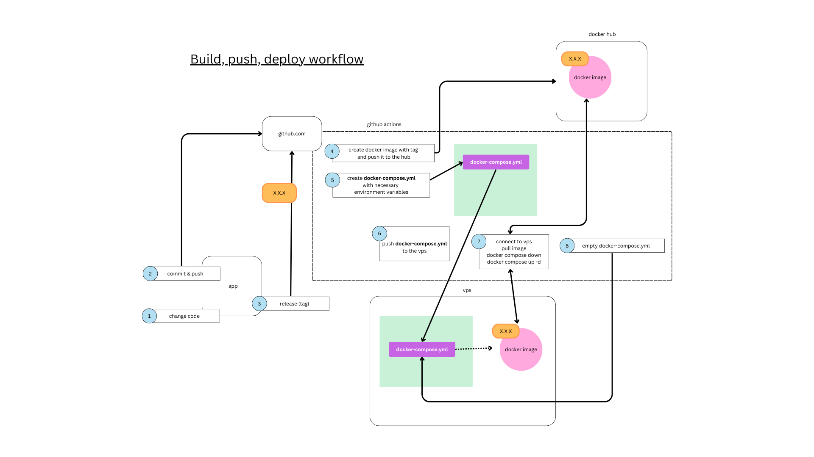

# Github Actions Workflows

Some github action workflows i use.

## build, push, deploy

This is a workflow i use for a code igniter 4 app.
It's based on docker images. Basically, once a new tag is pushed to the github repo, the docker image is pushed to the vps, and the new application stack is reloaded with docker compose up.

Note: the docker image doesn't contain any sensitive info (i.e.n no .env): environment variables are passed via the docker-compose file.

### Preparation steps

#### Create app and prepare github repo

- first create your app (find my example app in apps/ci4)
- prepare the github repo
- prepare .gitignore (find my example in apps/ci4/.gitignore)
- push it with initial commit and check no sensitive data is pushed
- once ok, add github secrets:

  - MYSQL_ROOT_PASSWORD
  - MYSQL_DATABASE
  - MYSQL_USER
  - MYSQL_PASSWORD
  - DOCKER_USERNAME
  - DOCKER_PASSWORD (personal access token)
  - the following depend on your code igniter .env file
  - HASH_SECRET_KEY
  - EMAIL_SMTPHOST
  - EMAIL_SMTPUSER
  - EMAIL_SMTPPASS
  - EMAIL_SMTPPORT

#### Prepare the server

- generate keys:
  - on local machine:
    - ssh-keygen -t ed25519 -a 100
  - then log to your server and add the public key to ~/.ssh/authorized_keys
  - on github repo, add secrets:
    - SSH_HOST
    - SSH_USERNAME
    - SSH_PORT
    - SSH_PRIVATE_KEY

#### Add the workflow in your code

- copy the workflow file in your repo (i.e. .github/workflows/build-push-deploy.yml), and adapt
